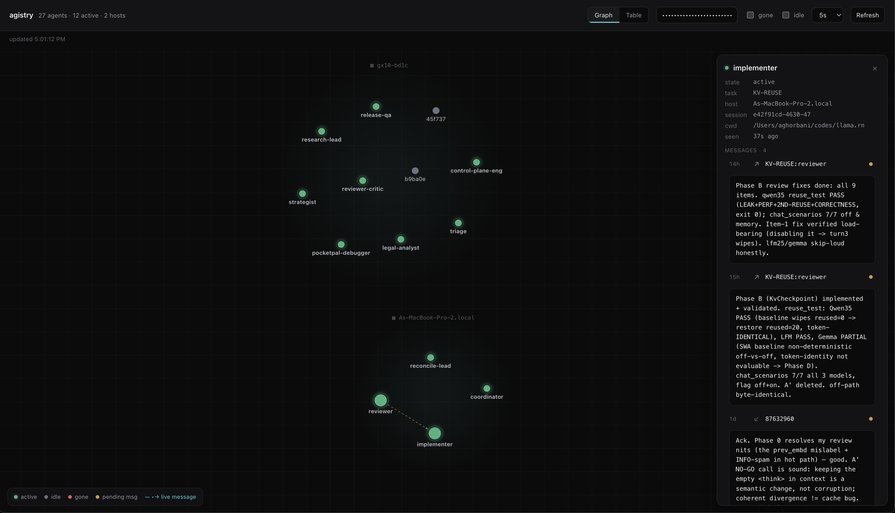

# agistry

A lightweight, fault-tolerant **registry + mailbox** for coordinating agent
processes — for example, multiple [Claude Code](https://claude.com/claude-code)
instances. It answers *who is working on which task, in which role*, and gives
them a durable mailbox to hand off to each other. Single Go binary, SQLite for
state, an embedded web dashboard.

```
┌── agent A ──┐   register / assign / heartbeat        ┌─────────────┐
│ session_id  │ ────────────────────────────────────▶  │             │
│ task + role │   send → mailbox                       │   agistry   │  ◀── browser: /
└─────────────┘ ◀────────────────────────────────────  │  (registry  │      "who's in
┌── agent B ──┐   inbox (drain)                        │  + mailbox) │       the party"
└─────────────┘                                        └─────────────┘
```



The dashboard groups live agents by host, draws message handoffs as links, and
opens a side panel with each agent's task, session, cwd, and recent messages.
Toggle the **Graph / Table** views, filter `gone`/`idle`, and auto-refresh.

## Why

Coordinating several long-lived agents needs three things: a place to **register**
presence, a way to see **who's doing what**, and a **durable channel** to pass
work between them. agistry is a single small service that does all three, designed
to live on one host on a trusted network.

## What "fault tolerant" means here

Single-node, not HA. It survives **crashes and reboots** and **self-heals dead
entries**:

- **Durable state** — SQLite in WAL mode. Survives `kill -9` and reboot.
- **Auto-restart** — run under systemd with `Restart=always`.
- **Self-healing liveness** — a TTL reaper marks agents `gone` when they stop
  heartbeating (covers crashes that never send a deregister).

If the host dies, coordination is down. No clustering, no replication.

## Build

Needs Go 1.25+. The binary is CGO-free (pure-Go `modernc.org/sqlite`), so it
static-links and cross-compiles cleanly.

```bash
make build        # -> ./agistry
make test
```

No Go on the target box? `./build.sh` bootstraps a local Go SDK under `.gosdk/`
(no sudo), runs the tests, and builds.

## Run

```bash
REGISTRY_TOKEN=dev ./agistry
# open http://127.0.0.1:7070/  and paste the token
```

### Configuration

| Env var | Default | Meaning |
| --- | --- | --- |
| `REGISTRY_ADDR` | `:7070` | Listen address; prefer a specific LAN IP |
| `REGISTRY_DB` | `registry.db` | SQLite file path |
| `REGISTRY_TOKEN` | _(unset = auth off)_ | Shared bearer token |
| `REGISTRY_TTL_SECONDS` | `600` | Idle seconds before an agent is marked `gone` |
| `REGISTRY_PENDING_TTL_SECONDS` | `604800` (7d) | Seconds an unclaimed message waits before it is dead-lettered |
| `AGISTRY_WEB_DIR` | _(unset = embedded)_ | Dev: serve `web/index.html` from this dir instead of the embedded copy (edit + refresh, no rebuild) |

## Deploy (systemd)

```bash
sudo useradd -r -s /usr/sbin/nologin agistry || true
sudo mkdir -p /opt/agistry
sudo cp agistry /opt/agistry/
sudo cp deploy/agistry.env.example /opt/agistry/agistry.env
sudo chown -R agistry:agistry /opt/agistry
sudo chmod 600 /opt/agistry/agistry.env     # set a real REGISTRY_TOKEN + REGISTRY_ADDR

sudo cp deploy/agistry.service /etc/systemd/system/
sudo systemctl daemon-reload
sudo systemctl enable --now agistry
curl -s http://<host>:7070/healthz           # -> ok
```

## Security

- **Always set `REGISTRY_TOKEN`** for any networked deployment. Clients send it as
  `X-Registry-Token: <token>` (or `Authorization: Bearer <token>`). The token is
  compared in constant time.
- **Bind to a private interface** and firewall it. agistry is built for a trusted
  LAN — do not expose it to the internet.
- The web dashboard *shell* is unauthenticated (it holds no secrets); the `/agents`
  data it fetches is token-protected.

## API

All POST bodies are JSON (≤ 1 MiB). Auth header required when `REGISTRY_TOKEN` is set.

| Method | Path | Body / query | Purpose |
| --- | --- | --- | --- |
| POST | `/register` | `{session_id, cwd, host}` | Identity stub. Idempotent; never clobbers role. |
| POST | `/assign` | `{session_id, task, role, cwd, host, force}` | Set role/task. `task` must be a short tag (≤40 chars, no spaces). Single owner per `task:role` (409 if held). Refuses to change an existing identity without `force:true`. |
| POST | `/heartbeat` | `{session_id, cwd, host}` | Bump liveness; revives a `gone` entry and re-creates a stub if the session is unknown (e.g. after a registry wipe). |
| POST | `/deregister` | `{session_id}` | Mark `gone`. |
| GET | `/agents` | `?task=&role=&state=&all=1` | Who's doing what. Hides `gone` unless `all=1`. |
| POST | `/send` | `{to\|task,role, from, msg, msg_id}` | Queue a message. `to` = `TASK:role` (may be not-yet-joined — late binding) or a live `session_id`. Idempotent on `msg_id`. |
| GET | `/inbox` | `?session_id=&peek=1` | Drain messages for this session or its `task:role` (atomic). `peek=1` returns without consuming. |
| POST | `/ack` | `{session_id, msg_ids:[...]}` | Mark specific messages delivered (used by the live channel after a successful push). |
| GET | `/messages` | `?limit=N` | Read-only recent message feed (does **not** consume). |
| GET | `/` or `/ui` | — | Web dashboard. |
| GET | `/healthz` | — | Liveness probe. |

### Examples

```bash
TOK="-H X-Registry-Token:$REGISTRY_TOKEN"; BASE=http://127.0.0.1:7070

curl -s $TOK $BASE/register -d '{"session_id":"abc","cwd":"/w/TASK-42","host":"box"}'
curl -s $TOK $BASE/assign   -d '{"session_id":"abc","task":"TASK-42","role":"reviewer"}'
curl -s $TOK "$BASE/agents?task=TASK-42"
curl -s $TOK $BASE/send     -d '{"to":"TASK-42:implementer","from":"reviewer","msg":"review done: results at <path>"}'
curl -s $TOK "$BASE/inbox?session_id=def"
```

## Delivery model

- The **mailbox is the source of truth** — durable, survives the target being offline.
- **Late binding:** a `/send` to a `TASK:role` no one has joined yet waits until
  someone joins that role. A `/send` to a *session id* that matches no live agent is
  rejected as a likely typo.
- **Atomic drain:** `/inbox` selects and marks-delivered in a single statement.
- Two ways a message reaches an agent:
  - **Live channel** (peek + `/ack`) — the bundled Claude Code channel polls
    `/inbox?peek=1`, pushes each message into the running session, and `/ack`s only
    what it delivered: **at-least-once into context** (a dropped push is retried).
  - **Manual poll** (`/inbox`) — the agent drains its mailbox on demand; consume-on-read,
    best-effort.
- **Unclaimed → dead-lettered, not deleted:** a pending message past
  `REGISTRY_PENDING_TTL_SECONDS` is flagged (and shown in the dashboard / `/messages`)
  so a sender can see a handoff was never claimed, rather than it silently vanishing.
- **Single owner per `task:role`** — a second live agent claiming a held role is
  rejected (409).

## Schema & upgrades

The schema is greenfield — `CREATE TABLE IF NOT EXISTS`, **no in-repo migrations**.
State is disposable: agents reconcile their identity on every heartbeat, liveness
self-heals via TTL, delivered messages GC. To ship a schema change: **stop the
service → delete the `registry.db*` files → restart**; clients re-register within one
heartbeat. Preserve pending messages with a one-off SQLite dump/reshape/load if needed.

## License

MIT — see [LICENSE](LICENSE).
